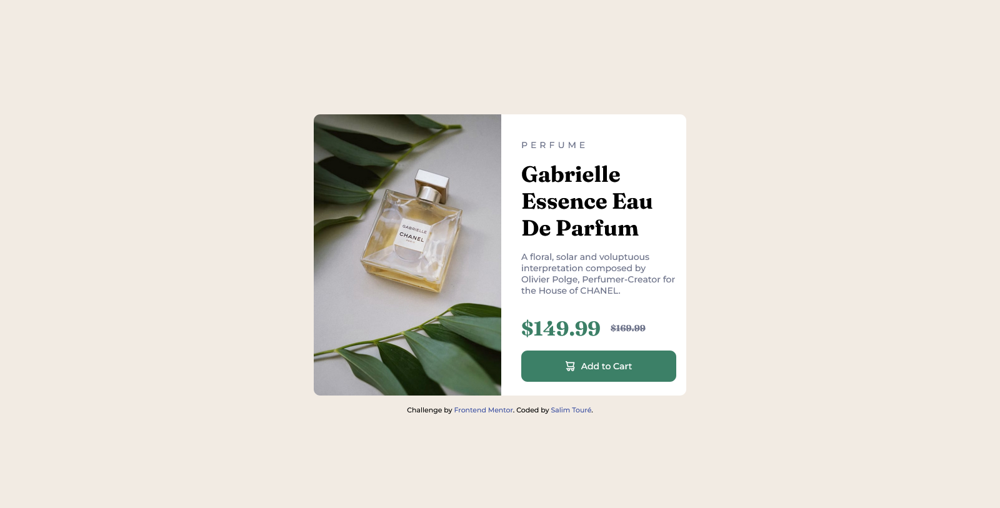

# Frontend Mentor - Product preview card component solution

This is a solution to the [Product preview card component challenge on Frontend Mentor](https://www.frontendmentor.io/challenges/product-preview-card-component-GO7UmttRfa). Frontend Mentor challenges help you improve your coding skills by building realistic projects.

## Table of contents

- [Overview](#overview)
  - [The challenge](https://www.frontendmentor.io/challenges/product-preview-card-component-GO7UmttRfa)
  - [Screenshot](./screenshot.png)
- [My process](#my-process)
  - [CSS Flexbox](https://developer.mozilla.org/en-US/docs/Learn/CSS/CSS_layout/Flexbox)
  - [Sass](https://sass-lang.com/)
- [limsael](#https://www.frontendmentor.io/profile/limsael)

## Overview

### The challenge

Users should be able to:

- View the optimal layout depending on their device's screen size
- See hover and focus states for interactive elements

### Screenshot



### Links

- Solution URL: [Solution URL](https://www.frontendmentor.io/solutions/product-preview-card-component-html-and-sass-ErO7hIk1JF)
- Live Site URL: [Live site URL](https://limsael.github.io/product-preview-card-component/)

## My process

### Built with

- Semantic HTML5 markup
- CSS custom properties
- Flexbox
- Mobile-first workflow

### What I learned

```css
.card{
  &__img-mobile {
    width: 100%;
    border-top-left-radius: 10px;
    border-top-right-radius: 10px;
  }

  &__img-desktop {
    display: none;
  }
}

@media screen and (min-width: 768px) {
  .card {
      &__img-mobile {
      display: none;
    }

    &__img-desktop {
      display: block;
      width: 300px;
      border-top-left-radius: 10px;
      border-bottom-left-radius: 10px;
    }
  }
}
```

## Author

- Frontend Mentor - [@limsael](https://www.frontendmentor.io/profile/limsael)
- Twitter - [@limsael525](https://www.twitter.com/limsael525)
